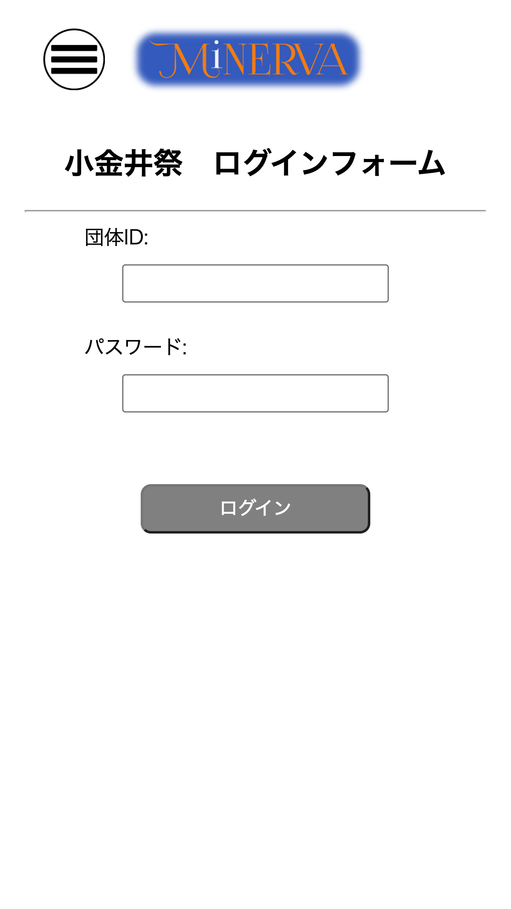
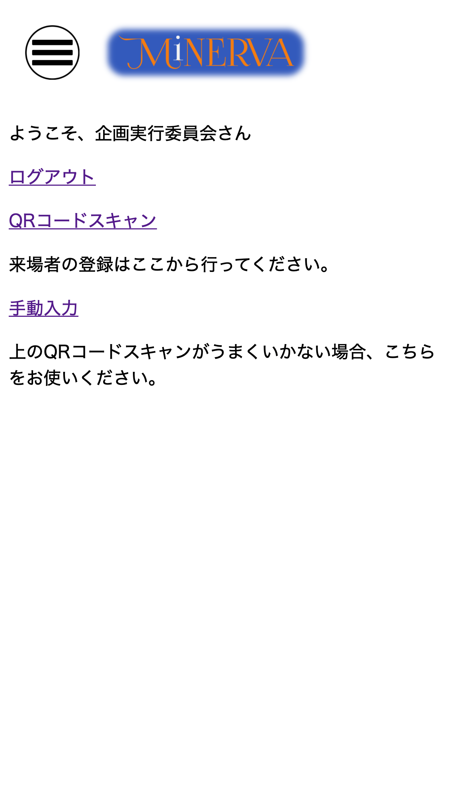

## ログイン

### どんなときに使う？

**団体運営者用の機能を使うとき**

ほぼ必ずログインが必須と考えてください

### どうやる？

#### I ログインページに遷移

[https://minerva.hosei-u.com/login](https://minerva.hosei-u.com/login)

#### II あらかじめ配布したアカウントでログイン

Home画面に遷移します

#### III 行いたい操作を行う

QRコードや手動での登録ができます。

------------------------------
[前のページ](./01_about_MiNERVA.md) | [次のページ](./03_checkin.md)