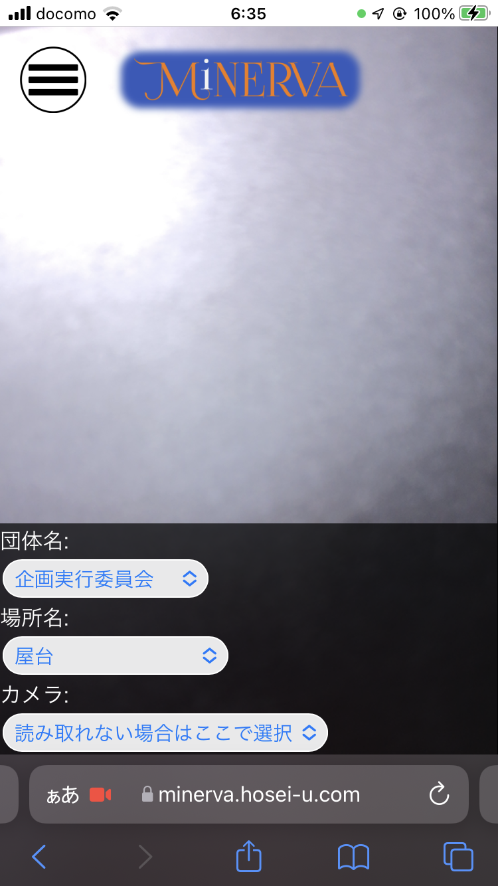
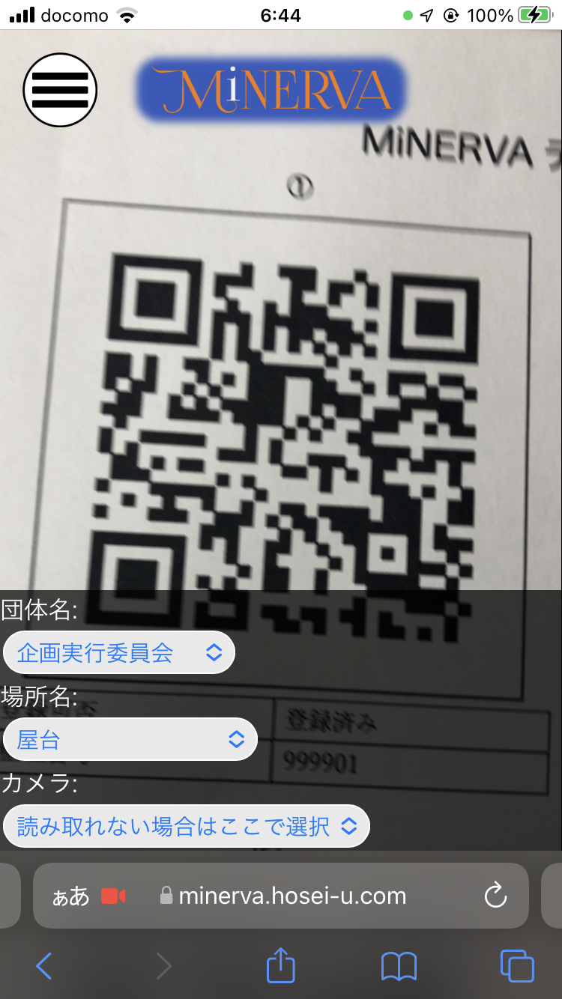
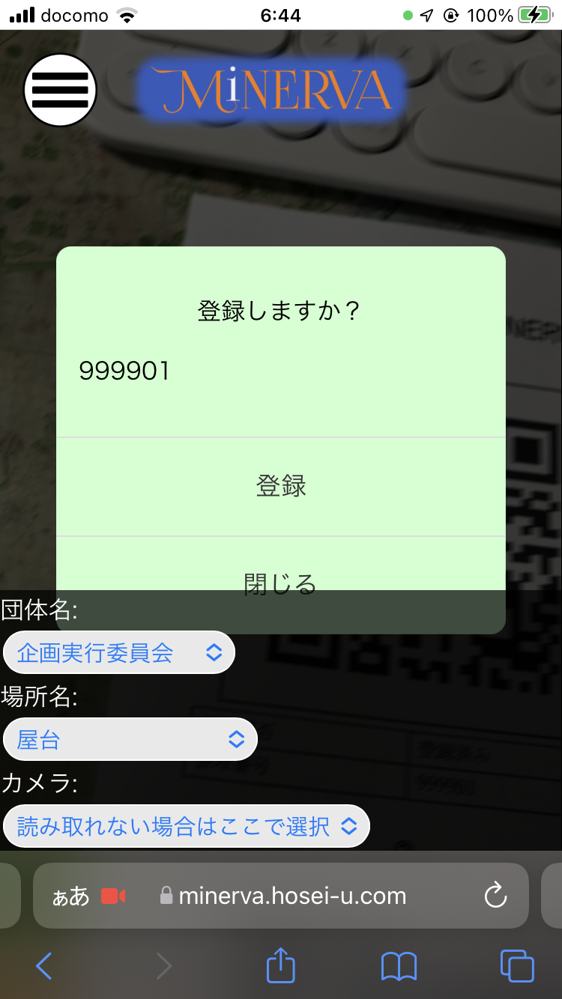
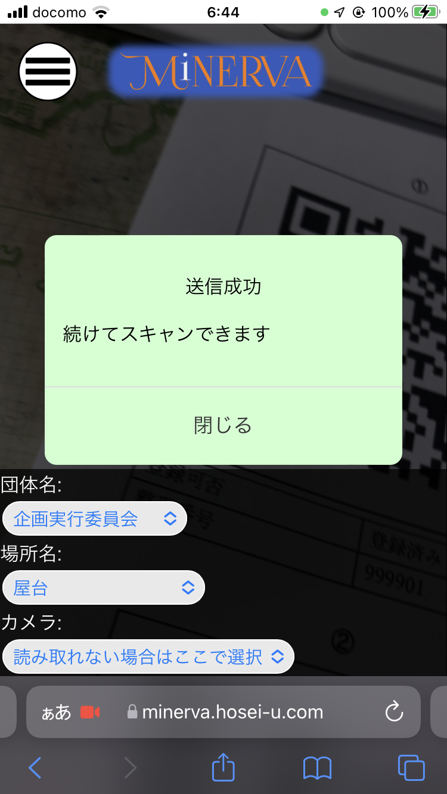
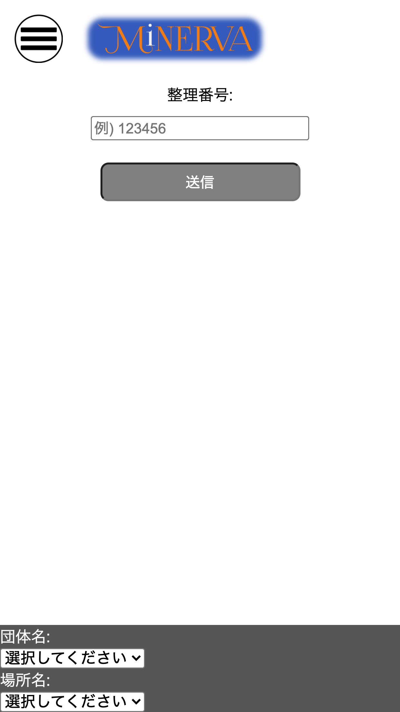
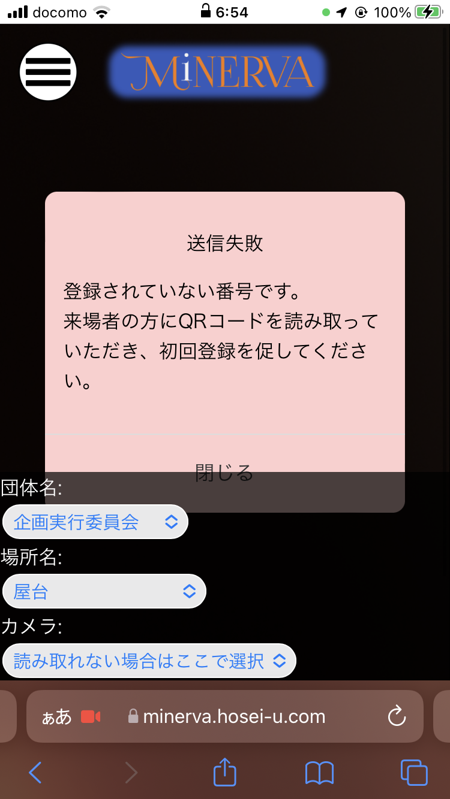

## 来場者登録

### どんなときに使う？

**来場者が自分のブースに訪れたとき**

必ず登録を行ってください。  

### どうやる？

[故障かな？と思ったら](./80_troubleshooting.md)も参考にしてください

#### I ログイン状態で、QRコードスキャン画面にアクセス

iPhoneの場合はSafariを、Androidの場合はChromeもしくはGoogleアプリをお使いください。

[https://minerva.hosei-u.com/checkin/](https://minerva.hosei-u.com/checkin/)

#### II 許可を押下

カメラが起動します。

#### III 団体名と場所名を選択

複数出店している団体は、間違えないようにしてください。

#### III 来場者が提示するQRコードを読み取る

練習する場合、[MiNERVAテスト用シート](./90_minerva_test.pdf)の①をお使いください。

読み取ると、緑のダイアログが表示されるため、「登録」を押下

登録が成功すると、成功画面が出ます。

#### IV スマホがカメラに対応していない場合

手動入力画面から入力してください。

[https://minerva.hosei-u.com/checkin/use-form.php](https://minerva.hosei-u.com/checkin/use-form.php)

#### V 「登録されていない番号です。」と出る

練習する場合、[MiNERVAテスト用シート](./90_minerva_test.pdf)の②をお使いください。

来場者の方は、最初の企画に立ち寄る前に来場者登録が必要です。

来場者登録は、用紙のQRコードを一般的なQRコードリーダーで読み取ると登録できます。

**必ず来場者の方の端末で、登録をお願いしてください。**

------------------------------
[前のページ](./02_login.md) | [次のページ](./04_logout.md)